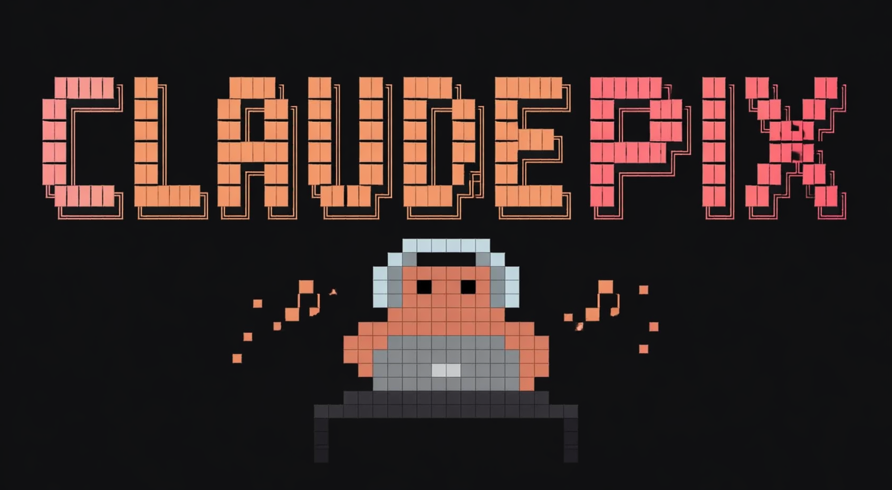

<div align="center">



**PIXEL ANIMATION LIBRARY**

A curated library of 20x20 pixel creature animations.
Browse live. Copy the code. Download as MP4. Drop it anywhere.
Every preset is self-contained HTML. No frameworks.

---


</div>

---

## What is ClaudePix

ClaudePix is a hand-crafted pixel animation library built around a single 20x20 creature character. Every animation is a self-contained HTML file powered by a shared micro-engine. Browse the live gallery, copy any preset with one click, paste it into your project, and it works instantly.

No React. No build step. No CDN. Just HTML that runs anywhere.

---

## Preview

| Work | Dance | Expressions | Idle |
|------|-------|-------------|------|
| Coding at desk | Bounce with DJ kit | Wink with sparkle | Breathing loop |
| Thinking pose | Lo-fi sway | Sleeping Zs | Look around |
| Typing hands | Head bob | Surprise recoil | Natural blink |

> Every card in the gallery is a **live iframe** running the real animation engine. What you see is exactly what you get.

---

## Features

**Browse**
- Live animated previews running in real time
- Filter by category: Work, Dance, Expressions, Idle
- Full-text search across names and descriptions
- Playback speed slider (0.25x to 3x) synced across all previews
- Preview-all compact grid mode

**Export**
- **Copy code** - copies a fully self-contained HTML file to clipboard. Works in any code editor, no setup needed
- **Download MP4** - records 3 full animation loops to a video file using canvas and MediaRecorder
- **View code** - syntax-highlighted code viewer with inline copy and download

**Design**
- Fully responsive across mobile, tablet, and desktop
- Mobile sidebar drawer with hamburger toggle
- Dark theme with customizable accent colors
- JetBrains Mono typography throughout

---

## Animation Catalog

### Work

| Preset | File | Description |
|--------|------|-------------|
| work coding | `work_coding.html` | Two-hand typing with head bob, blink, and cursor flicker on screen |
| work think | `work_think.html` | Deep in thought, chin rest, eyes up, thought particles drift, idea spark flashes |
| work type | `work_type.html` | Two-hand typing. Hands alternate up/down on an invisible keyboard |

### Dance

| Preset | File | Description |
|--------|------|-------------|
| dance bounce | `dance_bounce.html` | Energetic bounce, crouch, launch, arms wide at peak, squash on landing with dust |
| dance bounce dj | `dance_bounce_dj.html` | Bounce preset wearing full DJ headphones and turntable setup |
| dance sway | `dance_sway.html` | Chill lo-fi sway with arcing body movement, floating music notes, relaxed groove |
| dance sway dj | `dance_sway_dj.html` | Sway preset with DJ kit, vinyl scratch, and equalizer bars |
| dance djmix | `dance_djmix.html` | Full DJ session with mixing, headphone bob, and light show |
| dance bob | `dance_bob.html` | Head-bob to an imaginary beat. Up, down, up, down |

### Expressions

| Preset | File | Description |
|--------|------|-------------|
| expression wink | `expression_wink.html` | Playful wink, squint, close, head tilt, sparkle, then smoothly reopen |
| expression surprise | `expression_surprise.html` | Shock, anticipate, eyes widen, recoil up, shock lines radiate, then slowly settle |
| expression sleep | `expression_sleep.html` | Peaceful sleep with rhythmic head nod breathing, ascending Z particles |

### Idle

| Preset | File | Description |
|--------|------|-------------|
| idle breathe | `idle_breathe.html` | Smooth breathing loop, chest rises, mid-cycle blink, ambient dust particles |
| idle blink | `idle_blink.html` | Natural blink with half-close, double-blink sequence, and subtle gaze shifts |
| idle look around | `idle_look_around.html` | Eyes move first, head follows. Glance left, right, then up. Curious and alive |

---

## Getting Started

**Option 1 - Run locally**

```bash
git clone https://github.com/yourusername/claudepix.git
cd claudepix
```

Open `index.html` with any local server:

```bash
# VS Code Live Server, Python, or npx serve
npx serve .
# or
python -m http.server 5501
```

Then visit `http://127.0.0.1:5501/index.html`

**Option 2 - Use a single animation**

Click **copy** on any card. Paste the HTML anywhere. Open it in a browser. Done.

The copied file is fully self-contained. The engine is inlined. No external files needed.

**Option 3 - Download as MP4**

Click **download mp4** on any card. The library records 3 loops of the animation to a video file using the browser's MediaRecorder API. Works in Chrome, Edge, and Safari.

---

## File Structure

```
claudepix/
├── index.html              # Main gallery UI
├── app.js                  # Gallery logic, filtering, video export
├── animations/
│   ├── creature-engine.js  # Shared 20x20 pixel renderer
│   ├── idle_breathe.html
│   ├── idle_blink.html
│   ├── idle_look_around.html
│   ├── expression_wink.html
│   ├── expression_surprise.html
│   ├── expression_sleep.html
│   ├── dance_bounce.html
│   ├── dance_bounce_dj.html
│   ├── dance_sway.html
│   ├── dance_sway_dj.html
│   ├── dance_bob.html
│   ├── dance_djmix.html
│   ├── work_coding.html
│   ├── work_think.html
│   └── work_type.html
└── README.md
```

---

## How Animations Work

Each animation file defines a `PRESET` object with a `frames` array:

```javascript
const PRESET = {
  name: "idle breathe",
  category: "Idle",
  description: "Smooth breathing loop, chest rises, mid-cycle blink.",
  frames: [
    { hold: 500,  frame: null },       // null = draw base creature
    { hold: 280,  frame: INHALE },     // INHALE = 20x20 grid array
    { hold: 360,  frame: INHALE },
    { hold: 320,  frame: null },
  ],
};
```

The engine steps through frames using `requestAnimationFrame`, painting each 20x20 grid of colored `div` cells. Each cell value maps to a color:

```
0 = transparent (empty)
1 = body color  (#CD7F6A by default)
2 = eye color   (#0f0f0f)
```

Standalone animations (DJ, coding) use extended palettes with up to 10 named colors for props like headphones, laptop screens, and desks.

---

## Adding a New Animation

1. Create `animations/your_animation.html`
2. Add the filename to `MANIFEST` in `app.js`
3. Define your `PRESET` with frames using the engine helpers:

```javascript
const { BODY, EYE, CREATURE, shift, patch } = window.PixelEngine;

// shift moves the whole creature by (row, col) offset
const UP = shift(CREATURE, -1, 0);

// patch applies sparse overrides to any base grid
const BLINK = patch(CREATURE, [[6,7,BODY],[7,7,BODY]]);

const PRESET = {
  name: "my animation",
  category: "Idle",
  description: "What it does.",
  frames: [
    { hold: 400, frame: null },
    { hold: 200, frame: UP },
    { hold: 80,  frame: BLINK },
  ],
};

window.PRESET = PRESET;
window.PixelEngine.mount(document.getElementById('grid'), { preset: PRESET });
```

---

## Engine API

The shared engine (`creature-engine.js`) exposes:

| Export | Type | Description |
|--------|------|-------------|
| `BODY` | `number` | Cell value for body pixels (1) |
| `EYE` | `number` | Cell value for eye pixels (2) |
| `CREATURE` | `number[][]` | Base 20x20 idle pose grid |
| `shift(base, dr, dc)` | `function` | Translate all pixels by row/col offset |
| `patch(base, ops)` | `function` | Apply sparse cell overrides |
| `parseFrame(rows)` | `function` | Parse shorthand string rows into a grid |
| `mount(host, opts)` | `function` | Render and animate a preset into a DOM element |

`mount()` returns a control API:

```javascript
const api = PixelEngine.mount(el, { preset, speed: 1, color: '#CD7F6A' });

api.play();
api.pause();
api.setSpeed(2);
api.setColor('#8EC6A0');
api.destroy();
```

---

## Keyboard Shortcuts

| Key | Action |
|-----|--------|
| `/` | Focus search |
| `Esc` | Clear search and filters |
| `P` | Toggle preview-all mode |

---

## Tech Stack

| Layer | Technology |
|-------|------------|
| Rendering | Vanilla JS + CSS Grid |
| Animation | `requestAnimationFrame` step loop |
| Video export | Canvas API + MediaRecorder |
| Typography | JetBrains Mono |
| Hosting | Any static server |
| Build tools | None |

---

## Browser Support

| Browser | Live Preview | Copy Code | Download MP4 |
|---------|-------------|-----------|--------------|
| Chrome 94+ | Yes | Yes | Yes (MP4/H.264) |
| Edge 94+ | Yes | Yes | Yes (MP4/H.264) |
| Firefox | Yes | Yes | Yes (WebM/VP9) |
| Safari 15+ | Yes | Yes | Yes (MP4) |

---

## License

MIT. Use freely in personal and commercial projects. Attribution appreciated but not required.

---

<div align="center">

Built with zero dependencies. Runs anywhere HTML runs.

**ClaudePix** - Pixel Animation Library

</div>
